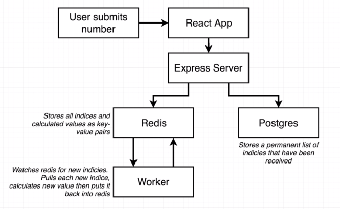
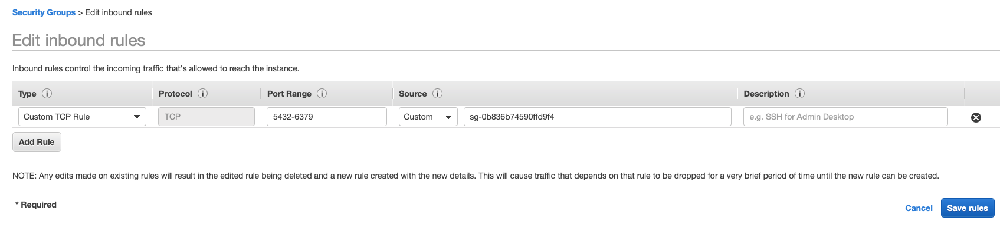

# Full Stack Docker

## Notes

- RDS hosting Postgres
- ElastiCache hosting Redis
- Elastic Beanstalk hosting client server, proxy server, api server, and worker
- VPC and Security Group config'd to have these things talk to each other
- Github -> Travis -> Docker Hub -> EB
- docker compose for local dev
- S3 for saving the code repo in AWS

firewall rules:

- allow any incoming traffic on port 80 to any IP
- allow any traffic from any other AWS service that has this security group

env variables:

- in EB config
  - everything you need in docker compose
- in travis
  - IAM programmatic access
  - docker hub id and password

